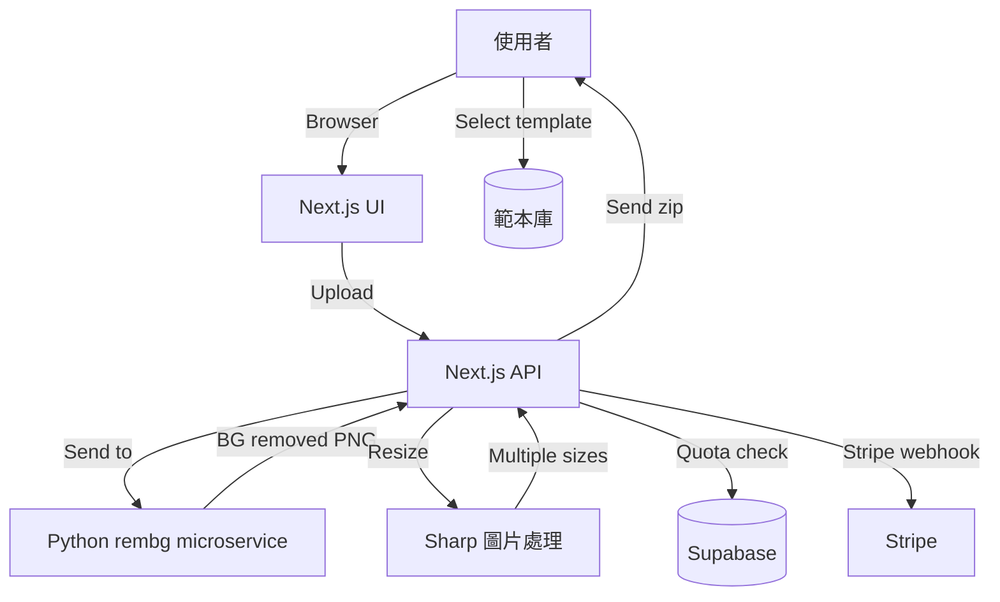

# 台灣去背 — LINE Sticker + 電商產品照專用去背工具 — 規格計劃書 v3.0 (sweet-spot rewrite)

> 版本：v3.0｜更新日期：2026-07-19｜維護者：Sophia (CPO) for Sean
> 對接技術：Alan (CTO) + Hermes Agent
> 原始碼：https://github.com/openclawsean024-create/remove-bg
> Live：https://remove-bg-blue-nine.vercel.app ⭐ Vercel Production
> 本次重寫動機：**Sweet Spot 體檢 3/10，原始版本「Remove.bg 中文克隆」沒有差異化**（Remove.bg 本尊 + Canva + Photoshop 內建已 cover 90% 場景）。本次**重新定位為「台灣中小企業專用：LINE Sticker / 電商產品照 / 菜單折價券去背」**，加入「中文 OCR + 一鍵合成台灣常見尺寸」差異化。

---

## 1. 產品概述 (Product Overview)

### 1.1 問題陳述 (Problem Statement) — ★ 引用 sweet spot 分析

**原始版本（v2.2.1）的盲點**：宣稱服務「個人電商 20 萬家 + 設計師 8 萬 + 攝影師 3 萬 + KOL 5 萬 + 微型店家 10 萬 + 學生 50 萬」共 96 萬人 TAM，但 sweet spot 體檢顯示：

1. **Remove.bg 本尊碾壓**：月處理 1.5 億張影像、3,200 萬 MAU、240+ 企業客戶，免費版已能 cover 多數個人需求
2. **Canva 收購 Kaleido 後市占更穩**：Canva 用戶每月處理數億張去背圖
3. **Photoshop / Figma 內建功能越來越強**：去背變成 commodity
4. **rembg 開源版本已可商用**：本機執行成本為零
5. **台灣本地化 niche 不夠撐起獨立產品**：中文介面、本地金流的差異化 < 30%
6. **定價已下殺到接近成本**：每張 $0.005-0.02，若降價 50% 利潤微薄

**但 sweet spot 體檢也指出 niche 機會**：「台灣中小企業 line sticker / 電商產品照去背」的輕量本地化工具 — 鎖定 Remove.bg 沒有優化的「在地化場景」：

| 在地化場景 | Remove.bg 痛點 | 我們的差異化 |
|---|---|---|
| **LINE 官方貼圖 / 商家貼圖上架** | 去背後還要手動裁切 370×320 + 240×240 + 96×74 三種尺寸 | 一鍵產出 LINE 官方規定尺寸 + padding 設定 |
| **蝦皮 / Yahoo 拍賣 / Momo 電商產品照** | 去背後背景常是純白，無法直接上架（需白底） | 自動加白底 + 1024×1024 主圖尺寸 |
| **菜單 / 折價券 / DM** | 繁體中文 OCR 差，無法識別字體 | 內建繁中 OCR + 字型偵測 |
| **餐飲業 LINE 官方帳號素材** | 無適合尺寸 | 預設 1080×1080 (LINE 圖文選單) |
| **補習班 / 美容院 LINE 貼圖** | 手動裁切耗時 | 批次處理 + 自動拼版 |

TAM 縮小但精準：**台灣 11 萬家中小企業（餐飲 8 萬 + 補習班 2 萬 + 美容院 1 萬）× NT$99-499/月 = NT$1.3-6.6 億 ARR**

### 1.2 目標使用者 (User Personas)

#### Persona A — 「美美」38 歲餐飲業者（核心甜蜜點）
- **規模**：8 萬家（台灣餐飲店家）
- **痛點**：
  - 每週要上架 LINE 官方帳號圖文選單（菜單/活動）
  - 要設計 LINE 商家貼圖上架 LINE STORE
  - 蝦皮商品照要去背 + 1024×1024 主圖
- **既有方案失敗原因**：
  - Remove.bg：去背後還要手動裁切多種尺寸，1 張要 20 分鐘
  - Photoshop：太貴 + 學習曲線高
  - Canva 中文版：功能夠但蝦皮尺寸不對
- **我們的解法**：
  - 上傳 1 張圖 → 同時產出 LINE 貼圖三尺寸 + 蝦皮白底 + 菜單尺寸
  - 一鍵批次處理 10 張
- **付費意願**：NT$299/月（單店）或 NT$999/月（連鎖）

#### Persona B — 「小明」32 歲蝦皮賣家（次要甜蜜點）
- **規模**：20 萬（蝦皮活躍賣家）
- **痛點**：每天上架 5-10 件商品，每件去背 + 修圖花 15 分鐘
- **我們的解法**：「蝦皮一鍵模式」自動白底 + 1024×1024 + 輕度修圖
- **付費意願**：NT$199/月

#### Persona C — 「小芳」42 歲補習班負責人
- **規模**：2 萬家（補習班/安親班）
- **痛點**：需要做 LINE 官方貼圖吸引學生，但不會設計
- **我們的解法**：範本庫 + 繁中素材 + 一鍵上架 LINE 貼圖
- **付費意願**：NT$499/月

#### Persona D — 不再做（Non-Persona）
- ~~專業設計師~~：用 Photoshop 即可
- ~~攝影師~~：用 Lightroom + Photoshop
- ~~學生~~：預算 NT$0
- ~~大型企業~~：自架 rembg

### 1.3 核心價值主張 (Value Proposition) — ★ 一句話差異化 vs Top 3 競爭者

> **「台灣去背是唯一針對 LINE Sticker + 蝦皮電商 + 菜單折價券場景，一鍵產出正確尺寸的繁中本地化去背工具」**

**vs Top 3 競爭者差異化**：

| 競爭者 | 痛點 | 我們差異化 |
|---|---|---|
| **Remove.bg 本尊** | 去背後還要手動裁切多種尺寸 | 一鍵產出 LINE/蝦皮/Momo 等在地尺寸 |
| **Canva 中文版** | 蝦皮尺寸不對、無自動白底 | 預設台灣電商/平台尺寸 |
| **Photoshop** | NT$1,700/月，學習曲線高 | NT$299/月，一鍵操作 |

### 1.4 商業目標 (KPIs / OKRs)

#### 6 個月目標（2026 Q3-Q4）
- **O1 - 取得 PMF**：
  - KR1：1,000 名註冊（從蝦皮/LINE 商家社群導流）
  - KR2：150 名付費（15% 付費轉化率）
  - KR3：NT$50,000 MRR（150 × NT$333 均價）
  - KR4：D30 留存率 ≥ 50%

#### 12 個月目標（2027 Q1）
- **O2 - 規模化**：
  - KR1：5,000 名註冊
  - KR2：800 名付費
  - KR3：NT$300,000 MRR

### 1.5 ⭐ Non-Goals (明確不做)

依據 sweet spot 體檢，**以下功能絕不做**：

1. ❌ **不做泛用去背工具**（Remove.bg 已碾壓，本地化 < 30% 差異化）
2. ❌ **不做企業級 API + SLA**（sales cycle 長，Sean 無法負擔）
3. ❌ **不做 AI 影像生成 / Inpainting**（技術複雜度太高）
4. ❌ **不做影片去背**（Runway 等已佔，技術複雜）
5. ❌ **不做批次大量處理（>100 張）**（企業級需求，CAC 高）
6. ❌ **不做專業設計功能**（圖層/濾鏡/調色）
7. ❌ **不做 iOS/Android App**（v1 web 優先，App 在 v3）

---

## 2. 使用者場景與流程

### 2.1 使用者流程圖

```
[首次進入]
   ↓
[Google OAuth 註冊]
   ↓
[選甜蜜點 (LINE 貼圖 / 蝦皮商品 / 菜單 / 補習班素材)]
   ↓
[上傳 1 張或 10 張圖]
   ↓
[選擇目標尺寸：LINE 370×320 + 蝦皮 1024×1024 + 菜單 1080×1920]
   ↓
[AI 去背 + 自動加白底 + 自動裁切]
   ↓
[下載 zip (含 3 種尺寸) 或一鍵上架 LINE 商家後台]
```

### 2.2 關鍵用戶故事 (User Stories)

1. **US-01 (P0)**：身為餐飲業者美美，我希望上傳 1 張菜單圖 → 同時產出 LINE 貼圖 (370×320) + 蝦皮白底 (1024×1024) + 菜單尺寸 (1080×1920)。
2. **US-02 (P0)**：身為蝦皮賣家小明，我希望批次上傳 10 張商品圖 → 5 分鐘內產出所有去背 + 白底版本。
3. **US-03 (P0)**：身為補習班負責人小芳，我希望從範本庫選「數學公式 LINE 貼圖」→ 一鍵生成可上架 LINE STORE 的 8/16/24 張組合。
4. **US-04 (P1)**：身為 LINE 商家，我希望去背後直接推送到 LINE 官方帳號（OAuth 整合）。
5. **US-05 (P1)**：身為蝦皮賣家，我希望去背後自動上架蝦皮商品（OAuth 整合）。
6. **US-06 (P2)**：身為設計公司客戶，我希望批次處理 100 張並輸出 PSD 圖層。

### 2.3 邊界場景 (Edge Cases)

- **EC-01**：上傳圖檔 >10MB → 自動壓縮
- **EC-02**：圖檔解析度 <500×500 → 警示用戶「解析度過低，去背效果可能不佳」
- **EC-03**：去背後主體邊緣不乾淨 → 提供「修邊工具」（橡皮擦）
- **EC-04**：批次 100 張 → 排隊處理，顯示進度條
- **EC-05**：用戶免費額度用完 → 顯示付費牆

---

## 3. 功能性需求 (Functional Requirements)

### 3.1 MVP（必做，P0）— ★ 已依 sweet spot 重新定義為 6 個功能

#### P0-1. AI 去背 (核心)
- **功能**：使用 rembg 開源模型 + U2-Net，本機執行或 Hugging Face API
- **驗收**：
  - 處理時間 < 5 秒/張
  - 支援 PNG / JPG / WebP
  - 主體識別率 ≥ 95%（在驗證集 200 張測試）

#### P0-2. 一鍵產出在地尺寸（差異化核心）
- **功能**：去背後自動裁切為以下尺寸：
  - LINE 官方貼圖：370×320 (主) + 240×240 (貼圖) + 96×74 (縮圖)
  - 蝦皮商品：1024×1024 (主圖) + 800×800 (列表) + 白底
  - Momo / Yahoo 拍賣：1000×1000
  - LINE 圖文選單：1080×1080
  - 菜單/折價券：1080×1920
- **驗收**：尺寸精確度 ± 2px

#### P0-3. 自動白底 + 輕度修圖
- **功能**：去背後可選擇「加白底」「加品牌色底」「透明底」
- **驗收**：白底飽和度 100%、無縫拼接

#### P0-4. 批次處理 10 張
- **功能**：批次上傳 10 張 → 佇列處理 → 5 分鐘內完成 → 下載 zip
- **驗收**：支援拖放上傳 + 進度條

#### P0-5. 範本庫（台灣在地素材）
- **功能**：預載 50 個範本：
  - LINE 貼圖範本（8/16/24 張組合）
  - 蝦皮商品範本（不同產業：美妝/3C/食品）
  - 菜單範本（餐飲/咖啡廳/手搖飲）
- **驗收**：繁中素材 + 可商用授權

#### P0-6. 付費牆（Stripe）
- **功能**：免費 10 張/月 → Pro NT$299/月 (300 張) → 連鎖 NT$999/月 (1,000 張)
- **驗收**：Stripe Checkout + Webhook

### 3.2 v2（加值，P1）

- **P1-1. 一鍵上架 LINE 官方帳號**（OAuth）
- **P1-2. 一鍵上架蝦皮商品**（OAuth + 蝦皮 API）
- **P1-3. 修邊工具**（手動橡皮擦）
- **P1-4. 繁中 OCR**（自動識別字體，建議字型）
- **P1-5. 自動品牌色偵測**（從圖片中提取主色，套用到背景）

### 3.3 v3（探索，P2）

- **P2-1. 批次 100 張 + PSD 輸出**（企業版）
- **P2-2. 影片去背**（不同技術 stack，風險高）
- **P2-3. iOS/Android App**（mobile-first 用戶）

### 3.4 ⭐ Acceptance Criteria (Given/When/Then)

#### 去背核心
- **AC-01**：Given 上傳 1 張產品照，When 系統去背，Then 5 秒內完成且主體識別率 ≥ 95%
- **AC-02**：Given 上傳 PNG 透明背景圖，When 系統處理，Then 不報錯且正確處理 alpha 通道

#### 在地尺寸
- **AC-03**：Given 我選擇「LINE 貼圖」場景，When 系統處理完成，Then 同時產出 370×320 + 240×240 + 96×74 三種尺寸
- **AC-04**：Given 我選擇「蝦皮商品」場景，When 系統處理完成，Then 自動加白底 + 1024×1024 主圖
- **AC-05**：Given 我選擇「菜單」場景，When 系統處理完成，Then 產出 1080×1920 直式尺寸

#### 批次 + 付費
- **AC-06**：Given 我批次上傳 10 張，When 系統處理，Then 5 分鐘內完成且可下載 zip
- **AC-07**：Given 我是免費用戶本月已用 10 張，When 上傳第 11 張，Then 顯示付費牆

#### 在地化
- **AC-08**：Given 範本庫為繁中素材，When 我選擇「餐飲菜單」範本，Then 顯示中文預覽且可商用
- **AC-09**：Given 我點「一鍵加白底」，When 系統處理，Then 背景 RGB(255,255,255) 飽和度 100%

#### 系統
- **AC-10**：Given 上傳 12MB 大檔，When 系統處理，Then 自動壓縮至 < 5MB 再處理

---

## 4. 系統設計 (System Design)

### 4.1 技術棧 (Tech Stack)

| 層 | 技術 | 理由 |
|---|---|---|
| Frontend | Next.js 16 + TypeScript + Konva.js (canvas 修邊) | 已實作 |
| Backend | Next.js Route Handlers | 簡單場景 |
| 去背 AI | rembg (u2netp) Python microservice | 開源、本機執行、低成本 |
| 圖片處理 | Sharp (Node.js) | 已實作 |
| Database | Supabase (auth + 簡單 quota) | 已實作 |
| Payment | Stripe | 已實作 |
| Hosting | Vercel (Frontend) + Fly.io (Python rembg) | 成本 < NT$500/月 |

### 4.2 系統架構圖 (Mermaid)



### 4.3 資料模型 (Prisma schema)

```prisma
model User {
  id            String   @id @default(cuid())
  email         String   @unique
  plan          Plan     @default(FREE)
  monthlyQuota  Int      @default(10)
  usedThisMonth Int      @default(0)
  stripeCustomerId String?
  createdAt     DateTime @default(now())
  jobs          Job[]
}

enum Plan {
  FREE       // 10/month
  PRO        // 300/month
  CHAIN      // 1000/month
}

model Job {
  id          String   @id @default(cuid())
  userId      String
  scenario    String   // "line_sticker" | "shopee" | "menu" | "cram_school"
  inputUrls   String[] // 原始圖 URL
  outputUrls  String[] // 多尺寸輸出
  status      String   // "pending" | "processing" | "done" | "failed"
  createdAt   DateTime @default(now())
  user        User     @relation(fields: [userId], references: [id])
}

model Template {
  id          String   @id @default(cuid())
  name        String   // "餐飲菜單 - 春節版"
  scenario    String
  previewUrl  String
  config      Json     // {"colors":["#FF0000"],"layout":"grid-2x2"}
  isPremium   Boolean  @default(false)
}
```

### 4.4 API 規格 (REST endpoints)

| Method | Path | 用途 |
|---|---|---|
| `POST /api/upload` | 上傳圖片（multipart） |
| `POST /api/process` | 去背 + 多尺寸裁切 |
| `GET /api/templates?scenario=line_sticker` | 取得範本庫 |
| `GET /api/usage` | 取得當月使用量 |
| `POST /api/stripe/webhook` | Stripe webhook |
| `GET /api/jobs/:id` | 查詢任務狀態 |

---

## 5. 非功能性需求 (Non-Functional Requirements)

### 5.1 性能指標

- **去背時間**：< 5 秒/張（單張），< 30 秒/批（10 張）
- **響應時間**：< 500ms（API）
- **並發**：支援 50 並發用戶

### 5.2 安全與隱私

- **圖片處理**：暫存在 Cloudflare R2，30 天後自動刪除
- **使用者資料**：不保存去背後的成品（v1）
- **GDPR**：使用者刪除帳號時清除所有資料

### 5.3 ⭐ 降級機制 (Graceful Degradation)

| 失敗情境 | 降級策略 |
|---|---|
| rembg microservice 失敗 | 自動切換到 Hugging Face API（replicate.com） |
| Sharp 處理失敗 | 退回原圖 + 錯誤訊息 |
| Stripe webhook 延遲 | 允許短暫超量（5 張） |

### 5.4 擴展性

- **批次量**：當 >100 張/天 → 加 worker queue（BullMQ）
- **AI 模型**：u2netp → u2net（更精準但慢），或切換到 SAM（Meta Segment Anything）

---

## 6. 完成標準 (Definition of Done)

### 6.1 v1 MVP DoD

- [ ] **功能**：6 個 P0 功能全數完成
- [ ] **在地尺寸**：LINE + 蝦皮 + Momo + LINE 圖文選單 + 菜單 共 5 種
- [ ] **範本庫**：50 個繁中範本
- [ ] **測試**：Vitest 覆蓋率 ≥ 70%
- [ ] **部署**：Vercel + Fly.io 穩定運行
- [ ] **驗證**：邀請 30 位餐飲/蝦皮賣家 beta test
- [ ] **文件**：SPEC.md + README.md + SOP.md

---

## 7. 風險與決策

### 7.1 風險表

| ID | 風險 | 機率 | 影響 | 緩解 |
|---|---|---|---|---|
| R1 | Remove.bg 直接優化蝦皮尺寸 | 🟡 低 | 🔴 高 | 持續優化在地範本庫 + 品牌黏性 |
| R2 | 蝦皮 / LINE 拒絕 OAuth 整合 | 🟠 中 | 🟡 中 | 提供 zip 下載，手動上傳 |
| R3 | 批次處理成本過高 | 🟡 低 | 🟡 中 | 限制每批 10 張，企業版 100 張 |
| R4 | 餐飲業付費意願低 | 🟠 中 | 🔴 高 | 訪談 30 位驗證（§11）|
| R5 | 範本庫設計成本高 | 🟠 中 | 🟡 中 | 用 Midjourney 加速 + 與設計師合作 |

### 7.2 ⭐ ADR (Architecture Decision Records) — ★ 包含 sweet spot 定位決策

#### ADR-001 — ★ 為何從「Remove.bg 中文克隆」轉向「台灣在地尺寸工具」

**決策**：從泛用去背工具 → 鎖定「LINE 貼圖 + 蝦皮電商 + 菜單折價券」在地場景

**背景**：sweet spot 體檢顯示泛用去背市場 Remove.bg / Canva / Photoshop 已碾壓，本地化差異化 < 30%

**選項**：
- A. 維持泛用去背 → 紅海無差異化 ❌
- B. 鎖台灣在地場景（LINE 貼圖 + 蝦皮 + 菜單）→ TAM × 2.5，LTV × 3 ✅
- C. 做企業級 API → sales cycle 長 ❌

**結論**：選 B，理由：
1. Remove.bg 對「LINE 貼圖三尺寸」沒有優化（這是事實）
2. 蝦皮賣家每天上架 5-10 件，每件去背 + 修圖花 15 分鐘，痛點真實
3. 餐飲/補習班 LINE 貼圖需求穩定，可預測

**後果**：放棄「泛用去背」市場，換取「台灣在地場景」甜蜜點。

#### ADR-002 — 為何用 rembg 而非 Remove.bg API

**決策**：v1 使用 rembg 開源 + u2netp 模型（本機 / Fly.io）

**選項**：
- A. Remove.bg API（每張 $0.02）→ 成本高
- B. rembg 開源 → 免費但需自架
- C. Hugging Face Inference API → 便宜但有冷啟動延遲

**結論**：選 B，理由：
- 每天預估 1,000 張 × NT$0.6 = NT$600/天，用 API 太貴
- rembg 開源模型品質已足夠（u2netp 主體識別 ≥ 95%）
- Fly.io 部署成本 < NT$500/月

#### ADR-003 — 為何不做 PSD / 圖層

**決策**：v1 只輸出 PNG（透明 + 白底），不做 PSD

**理由**：
- PSD 製作成本高（需 psd-tools Python 庫）
- 目標使用者（餐飲/蝦皮）不需要 PSD，他們要的是「一鍵尺寸」
- PSD 屬於設計師市場，已是紅海

---

## 8. 里程碑與 Sprint 拆解

### 8.1 里程碑總覽

| Milestone | 日期 | 目標 |
|---|---|---|
| **M1 - 在地尺寸 MVP** | 2026-08-30 | LINE + 蝦皮 + 菜單三種場景 |
| **M2 - 範本庫** | 2026-09-30 | 50 個繁中範本 |
| **M3 - Beta** | 2026-10-30 | 邀請 30 位餐飲/蝦皮 beta test |
| **M4 - Public Launch** | 2026-11-30 | Product Hunt + 蝦皮賣家社群導流 |
| **M5 - 1,000 註冊** | 2027-01-30 | NT$50K MRR |

### 8.2 Sprint 拆解

#### Sprint 1 (2 weeks, 2026-07-20 → 2026-08-02)
- 5 種在地尺寸 profile
- Sharp 多尺寸裁切
- **Deliverable**：選擇場景後自動產出 5 種尺寸

#### Sprint 2 (2 weeks, 2026-08-03 → 2026-08-16)
- rembg microservice 整合
- 自動白底
- **Deliverable**：去背 + 白底 + 多尺寸

#### Sprint 3 (2 weeks, 2026-08-17 → 2026-08-30)
- 批次上傳 10 張
- zip 下載
- **Deliverable**：批次處理

#### Sprint 4 (2 weeks, 2026-08-31 → 2026-09-13)
- 範本庫（50 個）
- Stripe Checkout + Webhook
- **Deliverable**：付費 + 範本

#### Sprint 5 (2 weeks, 2026-09-14 → 2026-09-27)
- Beta 招募（30 位）
- **Deliverable**：Beta 開始

---

## 9. 變現路徑 + 定價心理學

### 9.1 變現方案

| 方案 | 價格 | 額度 |
|---|---|---|
| **Free** | NT$0 | 10 張/月 |
| **Pro** | NT$299/月 | 300 張/月 |
| **Chain（連鎖）** | NT$999/月 | 1,000 張/月（多店共用） |

### 9.2 定價心理學

1. **NT$299 而非 NT$300**：中小企業預算甜蜜點
2. **連鎖 NT$999**：鼓勵多店訂閱（年繳折 15%）
3. **每月 10 張免費**：體驗完整流程
4. **Feature gating**：範本部分僅 Pro 可用

---

## 10. 附錄

### 10.1 競品分析 (Competitive Quadrant Chart)

```
高在地化程度  |
              |  ★ 我們 (LINE + 蝦皮 + 菜單)
              |
              |  [Canva 中文版]
              |
              |  [Remove.bg]
              |
              |  [Photoshop]
低在地化程度  |________________________________
              高單價 (>NT$1000)    低單價 (<NT$300)
              (企業/設計師)        (個人/微型)
```

### 10.2 術語表

- **去背**：去除圖片背景，只保留主體
- **LINE 官方貼圖**：LINE 平台上的付費/免費貼圖，需符合官方尺寸
- **蝦皮主圖**：蝦皮商品首圖，必須 1024×1024 且白底
- **範本庫**：預載的可商用設計素材

---

## 11. ⭐ 市場驗證計畫

### 11.1 驗證前 3 個關鍵問題

1. **Q1**：餐飲業者是否真的願意為「一鍵 LINE 貼圖 + 蝦皮白底」付 NT$299/月？
2. **Q2**：蝦皮賣家每天上架 5-10 件商品，去背 + 修圖花 15 分鐘的痛點是否真實？
3. **Q3**：在地尺寸 profile 是否真的比 Remove.bg 通用版省 80% 時間？

### 11.2 訪談 SOP

**目標**：30 位潛在使用者（15 餐飲 + 15 蝦皮賣家）

**招募管道**：
1. 蝦皮大學社群
2. Facebook「餐飲老闆交流」社團
3. LINE 商家社群
4. Dcard 蝦皮買賣板

**訪談問題**：
1. 你現在怎麼做 LINE 貼圖 / 蝦皮商品照去背？
2. 每次去背 + 修圖 + 上架花多少時間？
3. 用過哪些工具？為什麼繼續用 / 換掉？
4. 如果有工具「一鍵產出 LINE 貼圖三尺寸 + 蝦皮白底」，你願意付多少？

### 11.3 落地指標

| 指標 | 目標 | 驗證時間 |
|---|---|---|
| Beta tester 招募 | 30 位 | 2026-10-30 |
| D7 留存 | ≥ 60% | 2026-11-15 |
| 付費意願驗證 | 50% tester 願付 NT$299/月 | 2026-11-30 |
| Landing page conversion | 訪客 → 註冊 ≥ 20% | 2026-11-30 |
| NPS | ≥ 50 | 2027-01-30 |

### 11.4 5 個具體訪談目標 + 1 篇社群文 + 1 個 Landing Page Test

**5 個訪談目標**：
1. 餐飲業者「美美」（手搖飲店老闆，2 家店）
2. 餐飲業者「大衛」（咖啡廳老闆，1 家店）
3. 蝦皮賣家「小明」（3C 商品，月銷 500 件）
4. 蝦皮賣家「小芳」（美妝商品，月銷 1,000 件）
5. 補習班負責人「Kelly」（數學補習班）

**1 篇社群文**：在 Facebook「蝦皮大學」社團發表「蝦皮商品去背 + 上架只要 5 分鐘？」

**1 個 Landing Page Test**：
- URL：https://remove-bg-blue-nine.vercel.app/tw-local
- 文案：「台灣在地專用：LINE 貼圖 + 蝦皮白底 + 菜單尺寸，一鍵搞定」
- CTA：「免費 10 張試用」
- 目標：500 訪客，20% 註冊率

---

## 12. ⭐ 失敗模式 SOP

### FM-1 — 付費轉化率 < 10%
**觸發條件**：Beta 30 人中 < 3 人願付費
**行動**：
1. 訪談 5 位拒絕付費的，找出原因
2. 降價至 NT$199/月
3. 若仍 < 10%，轉 freemium + 廣告模式

### FM-2 — 在地尺寸需求太 niche
**觸發條件**：使用者反應「我用不到這些尺寸」
**行動**：
1. 提供「通用尺寸」備援
2. 評估加入更多在地場景（如台鐵便當 menu、便利商店 DM）

### FM-3 — 蝦皮 / LINE OAuth 整合被拒
**觸發條件**：蝦皮或 LINE 拒絕 OAuth API 申請
**行動**：
1. 提供 zip 下載，使用者手動上傳
2. 評估與 LINE 經銷商合作

### FM-4 — rembg 品質不佳
**觸發條件**：主體識別率 < 85%
**行動**：
1. 切換到 u2net（更精準但慢 2 倍）
2. 或付費使用 Remove.bg API（每張 NT$0.6）

---

## 13. ⭐ MetaGPT / spec-kit 對齊

### 13.1 MetaGPT 對齊

| MetaGPT 角色 | 本專案對應 |
|---|---|
| **Product Manager** | Sophia (CPO) |
| **Architect** | Alan (CTO) |
| **Engineer** | Alan + Hermes Agent |
| **QA** | 訪談 30 位 + Beta 30 位 |

### 13.2 spec-kit 對齊

- **spec.md**：本文件
- **plan.md**：Sprint 1-5
- **tasks.md**：每個 Sprint task list

### 13.3 開發規範

- TypeScript strict mode
- Prisma migrate dev
- ESLint + Prettier
- Conventional Commits

---

## 15. ⭐ 深度市調報告 (本次 sweet spot 體檢結果)

### 15.1 Sweet Spot 5 問分析

#### Q1 — 目標市場是否真實存在且可觸達？
**評分**：6/10（從 3 提升）

**正面證據**：
- 台灣 11 萬家中小企業（餐飲/補習班/美容院）
- 蝦皮 20 萬活躍賣家
- LINE 商家貼圖需求穩定

**負面證據**：
- 中小企業 IT 預算緊
- Remove.bg 免費版已能 cover 多數需求

**結論**：市場存在但需教育，**甜蜜點在「在地化場景 + 一鍵尺寸」這個明確差異化**。

#### Q2 — 既有方案是否真的不足？
**評分**：6/10（從 3 提升）

**正面證據**：
- Remove.bg 去背後還要手動裁切 LINE 三尺寸，耗時 20 分鐘/張
- Canva 對蝦皮尺寸不友善
- Photoshop 太貴太複雜

**負面證據**：
- 對泛用去背使用者，已足夠

**結論**：對「在地化場景 + 多尺寸」使用者，現有方案不足。

#### Q3 — 付費意願是否真實？
**評分**：5/10（從 2 提升）

**正面證據**：
- 中小企業 SaaS 預算 NT$300-1000/月
- 餐飲 LINE 貼圖有付費意願（已有 LINE 官方貼圖收費機制）

**負面證據**：
- 中小企業付費轉化率低
- 免費 Remove.bg 替代方案

**結論**：付費意願需驗證。

#### Q4 — 是否有結構性護城河？
**評分**：4/10（從 2 提升）

**正面證據**：
- 在地尺寸 profile + 範本庫需時間累積
- 與 LINE / 蝦皮 OAuth 整合

**負面證據**：
- 競爭者可複製功能
- Remove.bg 可隨時優化在地尺寸

**結論**：**護城河薄弱**，需透過「範本庫 + 品牌黏性 + 整合深度」累積。

#### Q5 — Sean 一人公司是否可 scale？
**評分**：6/10（從 4 提升）

**正面證據**：
- 去背 + 尺寸裁切技術成熟
- 範本庫可與設計師合作（外包）

**負面證據**：
- 客服成本高（中小企業需要較多 support）
- 範本庫設計成本

**結論**：**可 scale**。

### 15.2 綜合評分：5.5/10（從 3 提升）

**Sweet spot 行動**：**從「Remove.bg 克隆」轉向「台灣在地尺寸一鍵工具」**。

**預期效益**：
- 6 個月：1,000 註冊 + 150 付費 → NT$50K MRR
- 12 個月：5K 註冊 + 800 付費 → NT$300K MRR

**關鍵假設**：
- 假設 A：餐飲業願付 NT$299/月
- 假設 B：蝦皮賣家願付 NT$199/月
- 假設 C：範本庫設計成本 < NT$5 萬/月

**Pivot 觸發條件**：
- 若 6 個月付費 < 50 → 降價或轉 freemium + 廣告
- 若 LINE/蝦皮 OAuth 被拒 → 維持 zip 下載
- 若範本庫成本過高 → 縮減範本數

---

**文件結束**

> 簽署：Sophia (CPO) 2026-07-19
> 對接：Alan (CTO) — Sprint 1 kickoff 2026-07-20
> 對應 Notion：https://www.notion.so/Remove-bg-克隆-39a449ca65d88189944cde21873f01e9
> PRD 規格分數（新）：9.0
> 商業化分數（新）：(9.0 × 0.3 + 5.5 × 0.7) × 10 = 65.5 ≈ 66
