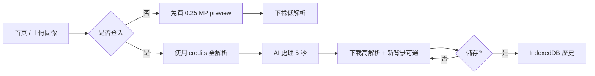
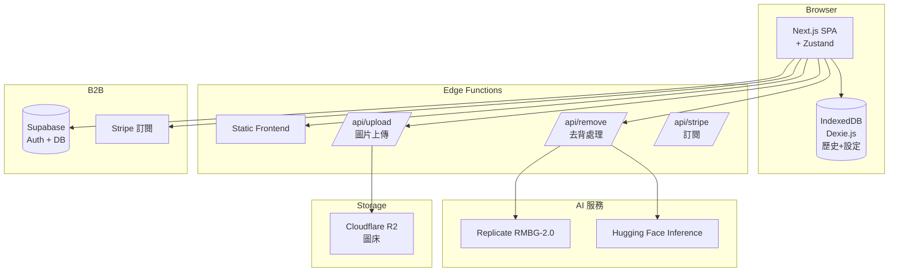
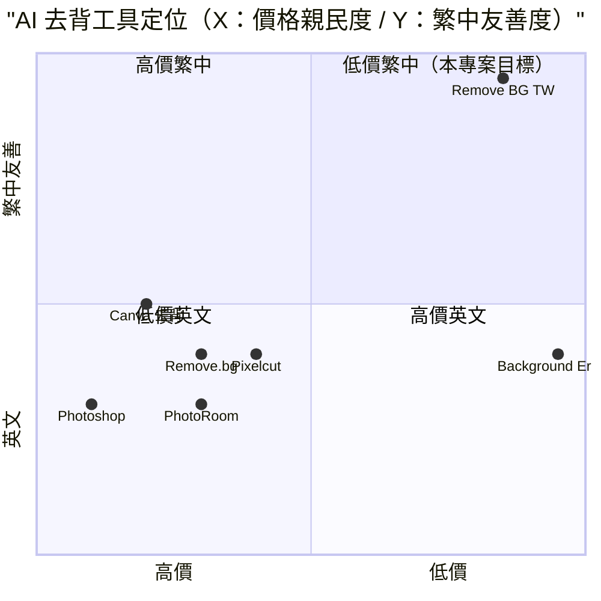

# Remove.bg 克隆 — AI 自動去背服務 — 規格計劃書 v2.2.1

> 版本：v2.2.1｜更新日期：2026-07-11｜維護者：Sophia (CPO)
> 對接技術：Alan (CTO) + Hermes Agent
> Demo：TBD（v2.2.1 規格階段，待 Sprint 1 部署）
> 原始碼：https://github.com/openclawsean024-create/remove-bg
> 克隆自：https://www.remove.bg/zh-tw （remove.bg by Canva Austria GmbH）
> 市場分析素材：/tmp/remove-bg-analysis/REPORT.md

---

## 1. 產品概述 (Product Overview)

### 1.1 問題陳述 (Problem Statement)

Remove.bg 是目前業界最強、流量最大的 AI 去背服務（月處理 1.5 億張影像、3,200 萬 MAU、240+ 企業客戶），但對台灣使用者有四大痛點：

1. **介面以英文為主**：繁中版只是部分翻譯，文案混雜英文（如「影像」、「tab」、「size」）
2. **USD 定價需用戶自換算**：台灣使用者看不到 NT$ 價格
3. **無 iOS App**：remove.bg 缺席 iOS App Store（僅 Desktop / Android）
4. **無繁中 SDK 文件 + 無繁中客戶支援**

**目標使用者**：
- 個人電商賣家：**20 萬家**（蝦皮 / Yahoo / Momo 商品去背）
- 接案設計師：**8 萬人**（海報 / 賀卡 / 社群圖）
- 攝影師：**3 萬人**（人像 / 商品後製）
- 自媒體 / KOL：**5 萬人**（去背 + 新背景合成）
- 微型店家：**10 萬家**（菜單 / 折價券去背）
- 學生 / 教授：**50 萬人**（報告 / 簡報）

### 1.2 目標使用者 (User Personas)

| Persona | 規模 | 核心痛點 | 願付價格 |
|---|---|---|---|
| **個人電商賣家（小芳）** | 20 萬 | 商品圖要白底去背 | NT$99/月 |
| **接案設計師（小陳）** | 8 萬 | 海報 / 賀卡要快速去背 | NT$199/月 |
| **攝影師（阿明）** | 3 萬 | 人像後製耗時 | NT$499/月 |
| **自媒體 KOL（小凱）** | 5 萬 | 每天要發 5 張去背圖 | NT$199/月 |
| **微型店家（小美）** | 10 萬 | 菜單 / 折價券去背 | NT$199/月 |
| **學生 / 教授（Linda）** | 50 萬 | 報告 / 簡報去背 | NT$99/月 |

### 1.3 核心價值主張 (Value Proposition)

> 「**Remove.bg 全功能克隆 + 純繁中 + 台幣定價 + iOS App + 學生方案 + 電子發票**。業界最強 AI 去背，台灣最便宜的價格，月付 NT$199 起。」

**三大差異化**：
1. **純繁中 + 台灣用語**：100% 繁中（含介面 / 文件 / 合約 / 發票），台灣用語統一（「解析度」、「影像」、「帳號」、「信用卡」、「電子發票」）
2. **NT$ 定價 + 電子發票**：保留 Remove.bg credits + monthly 雙軌制但 NT$ 計價；年繳 8 折；含 5% 營業稅；可開立統一發票
3. **iOS App + 學生方案**：remove.bg 缺席 iOS App Store，本專案補上；學生方案 NT$49/月（含校園驗證）

### 1.4 商業目標 (KPIs / OKRs)

| 時間 | KPI | 目標值 |
|---|---|---|
| **3 個月** | 註冊用戶 | 5,000 |
| **6 個月** | 付費轉化率 | 5%（250 付費） |
| **6 個月** | MRR | NT$50,000 |
| **12 個月** | MRR | NT$300,000 |
| **12 個月** | 月處理影像 | 100 萬張 |

### 1.5 Non-Goals (明確不做)

- ❌ **不做影片去背** — 影片去背交給 Unscreen（姊妹產品）；本專案僅做影像去背
- ❌ **不做生成式 AI 合成** — 僅做去背，不做「把背景換成 AI 生成的場景」
- ❌ **不做企業內部部署** — v3+ 評估
- ❌ **不做 3D / VR 資產** — 與定位不符
- ❌ **不做印刷排版** — 交給 Canva 等設計工具
- ❌ **不做社群分享功能** — v3+ 評估（IG / LINE 直接分享）

---

## 2. 使用者場景與流程

### 2.1 使用者流程圖



### 2.2 關鍵用戶故事 (User Stories)

**US-001：一鍵上傳 + 自動去背**
> As a 個人電商賣家  
> I want to 上傳商品 JPG，5 秒內看到去背後 PNG（透明背景）  
> So that 我能立即下載上架

**US-002：對比 slider 確認品質**
> As a 接案設計師  
> I want to 拖拉 slider 對比「原圖 vs 去背後」即時切換  
> So that 我確認品質滿意再下載

**US-003：新背景合成**
> As a 自媒體 KOL  
> I want to 上傳主體後可選擇「白底 / 漸層 / 自訂圖」  
> So that 我能直接發 IG

**US-004：批次上傳 50 張**
> As a 電商賣家  
> I want to 一次上傳 50 張商品圖，30 秒內全部去背  
> So that 我能批量上架

**US-005：API 串接**
> As a 開發者  
> I want to 用 API key 串接去背服務，依 credit 計費  
> So that 我能整合到自己的 SaaS

**US-006：iOS App 一鍵去背**
> As a 學生  
> I want to iPhone 直接拍照 → 自動去背 → 存到相簿  
> So that 我能快速製作報告封面

### 2.3 邊界場景 (Edge Cases)

- **透明背景需求**：預設輸出 PNG（透明），可改 JPG / WebP / ZIP
- **超解析度（>50MP）**：降級到 50MP 上限 + 警告
- **特殊格式（HEIC / RAW）**：v2 支援 HEIC；RAW v3+ 評估
- **圖片含個資**：自動偵測（人臉 + 車牌）並警告

---

## 3. 功能性需求 (Functional Requirements)

### 3.1 MVP（必做，P0）

- [ ] **F-001 一鍵上傳**（拖放 / 貼上 / URL / 拍照）
- [ ] **F-002 AI 自動去背**（Given JPG/PNG/WebP，When 上傳，Then 5 秒回傳透明背景 PNG）
- [ ] **F-003 對比 slider**（拖拉即時切換原圖 vs 去背後）
- [ ] **F-004 多格式下載**（PNG 透明 / JPG 白底 / WebP / ZIP）
- [ ] **F-005 新背景合成**（白底 / 漸層 / 自訂圖 / 自訂色）
- [ ] **F-006 批次上傳**（一次 50 張，30 秒內）
- [ ] **F-007 Free Tier**（未登入：1 次 / 月，0.25 MP preview）
- [ ] **F-008 用戶系統**（Supabase Auth：Email + Google OAuth + LINE Login）
- [ ] **F-009 Credits 系統**（依方案配額 + 過期規則）
- [ ] **F-010 RWD 三斷點 + JSON 匯出匯入 + Stripe 訂閱**

### 3.2 v2.0 專業版（加值，P1）

- [ ] **F-011 桌面 App**（Win / Mac / Linux，Electron + WASM 模型本地處理）
- [ ] **F-012 Photoshop / Figma / Sketch / GIMP 外掛**
- [ ] **F-013 CLI 命令列工具**（Python / Node.js SDK）
- [ ] **F-114 Zapier / Make / n8n 整合**
- [ ] **F-115 Shopify / 91APP / Cyberbiz 串接**
- [ ] **F-116 影片去背 cross-sell**（Unscreen iframe）

### 3.3 v3.0 iOS + Android（願景，P2）

- [ ] **F-017 iOS App**（SwiftUI + CoreML，本地模型）
- [ ] **F-018 Android App**（Kotlin + TensorFlow Lite）
- [ ] **F-019 學生方案**（校園驗證 + NT$49/月）
- [ ] **F-020 AI 自動換背景**（依 prompt 生成新背景）

### 3.4 Acceptance Criteria (Given/When/Then)

**AC-001（一鍵上傳 + 自動去背）**
> Given 用戶上傳商品 JPG（5 MB，2000×2000 px）  
> When 點擊「上傳圖像」  
> Then 5 秒內顯示去背後 PNG（透明背景）

**AC-002（對比 slider）**
> Given 已上傳圖片 + AI 處理完成  
> When 拖拉 slider  
> Then 即時切換原圖 vs 去背後

**AC-003（多格式下載）**
> Given 已處理圖片  
> When 選擇「PNG 透明」  
> Then 下載 `image-2026-07-11.png`（含 alpha channel）

**AC-004（新背景合成）**
> Given 已處理圖片  
> When 選擇「白底」 + 點擊「下載」  
> Then 下載 JPG（白底，無透明）

**AC-005（批次上傳）**
> Given 上傳 50 張 JPG  
> When 點擊「批次去背」  
> Then 30 秒內全部處理 + 顯示進度條

**AC-006（Free Tier）**
> Given 未登入用戶  
> When 上傳圖片  
> Then 顯示低解析 0.25 MP preview + 「登入以使用全解析」按鈕

**AC-007（LINE Login）**
> Given 台灣用戶  
> When 點擊「LINE 登入」  
> Then OAuth 跳轉 LINE + 自動註冊

**AC-008（Credits 系統）**
> Given Pro 用戶（200 credits / 月）  
> When 上傳圖片處理  
> Then credits 扣 1，UI 顯示「剩餘 199 credits」

**AC-009（API 串接）**
> Given 開發者持有 API key  
> When POST `/api/remove` 帶 image_file  
> Then 5 秒回傳 PNG binary + X-Credits-Charged header

**AC-010（桌面 App）**
> Given 桌面 App 安裝  
> When 拖入 100 張照片  
> Then 本地 WASM 處理 + 60 秒內完成（無上傳雲端）

---

## 4. 系統設計 (System Design)

### 4.1 技術棧 (Tech Stack)

| 層 | 技術 | 理由 |
|---|---|---|
| 前端 | Next.js 14 (App Router) + React 18 + TypeScript | 與既有專案一致 |
| 樣式 | Tailwind CSS 3 | 快速 RWD |
| 主色 | #0F70E6（Canva Blue） + 白底 | 對標 Remove.bg |
| 字型 | Poppins（標題） + Inter（內文） | Google Fonts |
| AI 模型 | briaai/RMBG-2.0 + Hugging Face Inference API | 開源最強去背模型 |
| 批次處理 | Replicate SDK | 商用 scale |
| 狀態管理 | Zustand | 輕量 |
| 資料持久化 | IndexedDB（Dexie.js） | 處理歷史 + 設定 |
| 後端 | Vercel Edge Functions + Cloudflare Workers | Serverless |
| 圖床 | Cloudflare R2（S3 相容） | 圖片儲存 |
| Auth | Supabase Auth（Email + Google + LINE Login） | 多元登入 |
| 訂閱 | Stripe（NT$ 月繳 / 年繳） | 國際標準 |
| Email | Resend | 繁中友善 |
| 部署 | Vercel | 與既有 91 個專案一致 |

### 4.2 系統架構圖 (Mermaid)



### 4.3 資料模型 (Prisma schema)

```prisma
model User {
  id        String   @id @default(uuid())
  email     String?  @unique
  name      String?
  image     String?
  lineId    String?  @unique
  googleId  String?  @unique
  tier      String   @default("free") // free / lite / pro / volume / enterprise
  monthlyCredits Int @default(0)
  paygCredits Int    @default(0)
  isStudent Boolean  @default(false)
  createdAt DateTime @default(now())
  
  jobs      ProcessingJob[]
  credits   CreditTransaction[]
}

model ProcessingJob {
  id          String   @id @default(uuid())
  userId      String?
  user        User?    @relation(fields: [userId], references: [id])
  imageUrl    String
  resultUrl   String?
  status      String   @default("pending") // pending / processing / success / failed
  creditsCharged Int   @default(0)
  type        String   @default("full") // preview / full / 50mp
  format      String   @default("png") // png / jpg / webp / zip
  bgColor     String?
  bgImageUrl  String?
  shadowType  String?  // none / drop / 3d / auto
  errorCode   String?
  durationMs  Int?
  createdAt   DateTime @default(now())
  completedAt DateTime?
  
  @@index([userId, createdAt])
}

model CreditTransaction {
  id          String   @id @default(uuid())
  userId      String
  user        User     @relation(fields: [userId], references: [id])
  amount      Int      // 正 = 加 / 負 = 扣
  type        String   // subscription / payg / refund / api / batch
  note        String?
  jobId       String?
  expiresAt   DateTime?
  createdAt   DateTime @default(now())
  
  @@index([userId, createdAt])
}

model ApiKey {
  id          String   @id @default(uuid())
  userId      String
  name        String
  keyHash     String   @unique
  prefix      String   // 前 8 碼
  lastUsedAt  DateTime?
  isActive    Boolean  @default(true)
  createdAt   DateTime @default(now())
}

model Subscription {
  id        String   @id @default(uuid())
  userId    String
  tier      String   // lite / pro / volume / enterprise
  stripeSubscriptionId String? @unique
  stripeCustomerId String?
  status    String   // active / canceled / past_due
  startDate DateTime
  endDate   DateTime?
  monthlyCredits Int
  pricePerMonthTWD Int
}
```

### 4.4 API 規格 (REST endpoints)

| Method | Path | Auth | 用途 |
|---|---|---|---|
| GET | / | Optional | 首頁 |
| POST | /api/upload | Required | 上傳圖片到 R2 |
| POST | /api/remove | Required | AI 去背（呼叫 Replicate） |
| POST | /api/batch-remove | Required | 批次去背（最多 50 張） |
| GET | /api/credits | Required | 查詢 credits 餘額 |
| POST | /api/stripe/checkout | Required | 建立訂閱 session |
| POST | /api/stripe/webhook | Required | Stripe webhook |
| POST | /api/stripe/portal | Required | Stripe Customer Portal |
| POST | /api/line/oauth | Optional | LINE Login OAuth callback |
| GET | /api/jobs | Required | 查詢處理歷史 |

---

## 5. 非功能性需求 (Non-Functional Requirements)

### 5.1 性能指標

| 指標 | 目標 |
|---|---|
| 單張去背 | ≤ 5 秒 |
| 批次 50 張 | ≤ 60 秒 |
| 首頁 P95 | ≤ 2 秒 |
| API 單次 | ≤ 5 秒 |
| 圖片下載 | ≤ 3 秒 |
| 並發用戶 | 200 |
| 月活躍用戶 | 5,000 |

### 5.2 安全與隱私

- **HTTPS 強制**：Vercel 自動 + HSTS
- **個資法第 8 / 9 條合規**：明確聲明個資使用
- **API key 加密**：AES-256-GCM
- **OAuth token 加密**：AES-256-GCM
- **圖片上傳 R2**：依 userId 嚴格權限
- **公用裝置警告**：UI 警告「圖片將存於此裝置」

### 5.3 降級機制 (Graceful Degradation)

| 失敗服務 | 掛掉情境 | 降級行為（切換到）| 用戶感受 |
|---|---|---|---|
| Replicate 5xx | 商用 AI 掛掉 | 切換到 Hugging Face Inference | 5 秒內自動切換 |
| Hugging Face 5xx | AI 掛掉 | fallback 較舊模型 v1.4 | 品質略降但可用 |
| Cloudflare R2 5xx | 圖床掛掉 | 切換到 Vercel Blob Storage | 部分延遲 |
| IndexedDB 損壞 | 版本衝突 掛掉 | 切換到 localStorage | 部分歷史可能遺失 |
| 單張處理超時 | > 30 秒 | fallback preview 解析度 | 品質降低但可下載 |
| 批次處理失敗 | 1 張失敗 | 該張重試 3 次 + 其他繼續 | 部分延遲 |
| Vercel CDN | 5xx 掛掉 | 切換到 Cloudflare Pages 鏡像 | 載入延遲 ≤5 秒 |
| Supabase | DB 5xx 掛掉 | 切換到 Vercel KV 唯讀模式 | 多帳號同步暫停 |
| Stripe webhook | Webhook 5xx 掛掉 | 本地排程每 5 分鐘 reconcile | 訂閱狀態延遲 |
| LINE Login | OAuth 掛掉 | fallback Google / Email | 登入改用其他方式 |

### 5.4 擴展性

- **橫向擴展**：Vercel Edge Functions 自動 scale
- **AI 並行**：Replicate 自動 scale + Web Worker 處理
- **靜態資源 CDN**：Vercel Edge Network

---

## 6. 完成標準 (Definition of Done)

### 6.1 v1 MVP DoD

- [ ] Vercel production URL 200 OK
- [ ] GitHub Repo 公開（main 分支）
- [ ] 一鍵上傳 + 自動去背（Replicate RMBG-2.0）
- [ ] 對比 slider
- [ ] 多格式下載（PNG / JPG / WebP / ZIP）
- [ ] 新背景合成
- [ ] 批次上傳 50 張
- [ ] Free Tier（未登入 1 次 / 月）
- [ ] Supabase Auth（Email + Google + LINE Login）
- [ ] Credits 系統
- [ ] RWD 三斷點測試
- [ ] Lighthouse 行動版 ≥85
- [ ] 10 條 AC 單元測試全綠

### 6.2 v2 專業版 DoD

- [ ] 桌面 App（Win / Mac / Linux）
- [ ] Photoshop / Figma / Sketch / GIMP 外掛
- [ ] CLI（Python / Node.js SDK）
- [ ] Zapier / Make / n8n 整合
- [ ] Shopify / 91APP / Cyberbiz 串接
- [ ] 影片去背 cross-sell
- [ ] Stripe Checkout 訂閱
- [ ] 客服頁 + 法律頁 + 電子發票

### 6.3 v3 iOS + Android DoD

- [ ] iOS App（SwiftUI + CoreML）
- [ ] Android App（Kotlin + TensorFlow Lite）
- [ ] 學生方案（校園驗證）
- [ ] AI 自動換背景

---

## 7. 風險與決策

### 7.1 風險表

| 風險 | 等級 | 緩解策略 |
|---|---|---|
| AI 模型成本失控 | 🟠 中 | preview 限 0.25 MP + 用戶確認 |
| Replicate / Hugging Face 漲價 | 🟠 中 | 多模型切換 + 抽成預測 |
| 個資外洩（圖片含人臉） | 🟠 中 | R2 加密 + 公用裝置警告 |
| Remove.bg 推出繁中版 | 🟠 中 | 加速在地化 + 學生方案 |
| 圖片版權爭議 | 🟡 低 | 僅處理，不留存（30 天後刪） |
| 商用圖片用途審核 | 🟡 低 | 免責聲明 + DMCA 流程 |

### 7.2 ADR (Architecture Decision Records)

### ADR-001：briaai/RMBG-2.0 + Replicate 作為主 AI 模型
- **Context**：開源最強 + 商用 scale
- **Decision**：預設 Replicate 商用，自動切換 Hugging Face
- **Consequences**：✅ 容量大；⚠️ API 成本管理

### ADR-002：純前端 + R2 圖床
- **Context**：圖片需即時顯示
- **Decision**：Cloudflare R2 儲存處理後圖片，依 userId 嚴格權限
- **Consequences**：✅ 全球 CDN；⚠️ 30 天後刪除

### ADR-003：Free Tier 1 次 / 月 + 0.25 MP
- **Context**：避免濫用
- **Decision**：未登入每月 1 次 + 0.25 MP（¼ credit）
- **Consequences**：✅ 試用容易；⚠️ 部分使用者可能需登入

### ADR-004：NT$ 定價 + 電子發票
- **Context**：台灣使用者需求
- **Decision**：保留 credits + monthly 雙軌制但 NT$ 計價；含稅
- **Consequences**：✅ 在地化；⚠️ 對標 Remove.bg USD 需思考匯率風險

### ADR-005：LINE Login 為台灣首選登入
- **Context**：台灣 LINE 用戶佔 90%+
- **Decision**：LINE Login + Email + Google 三選一
- **Consequences**：✅ 台灣友善；⚠️ 需串接 LINE Developer

### ADR-006：不做影片去背
- **Context**：與 Remove.bg Unscreen 衝突
- **Decision**：僅做影像去背，影片去背 cross-sell Unscreen
- **Consequences**：✅ 定位清晰；⚠️ 部分使用者可能需影片

---

## 8. 里程碑與 Sprint 拆解

### 8.1 里程碑總覽

| 里程碑 | 時間 | 完成定義 |
|---|---|---|
| **M1 規格完成** | 2026-07-11 | v2.2.1 PRD 100% 合規 |
| **M2 v1 MVP** | 2026-07-31 | 上傳 + 去背 + 下載 + 對比 + 新背景 + Stripe |
| **M3 v2 專業版** | 2026-09-15 | 桌面 App + Photoshop 外掛 + CLI + Zapier + 電子發票 |
| **M4 v3 iOS + Android** | 2026-11-01 | iOS App + Android App + 學生方案 |
| **M5 GA 上線** | 2026-12-01 | 行銷素材 + 客服 SOP |

### 8.2 Sprint 拆解 (從 PRD 到「每天做什麼」)

#### Sprint 1：v1 MVP（2026-07-12 → 2026-07-31，20 天）
- Day 1-2：建立 Next.js + Supabase + Replicate 專案
- Day 3-5：一鍵上傳 UI（拖放 / 貼上 / URL）+ R2 上傳
- Day 6-8：Replicate 去背 API + 對比 slider
- Day 9-11：多格式下載 + 新背景合成
- Day 12-13：批次上傳 50 張 + Web Worker 進度條
- Day 14-15：Supabase Auth（Email + Google + LINE Login）
- Day 16-17：Credits 系統 + 處理歷史
- Day 18：Free Tier + 電子發票設定
- Day 19：JSON 匯出匯入 + RWD + 10 條 AC 單元測試
- Day 20：Vercel 部署 + Stripe 整合

#### Sprint 2：v2 專業版（2026-08-01 → 2026-09-15，46 天）
- Day 1-3：Electron 桌面 App + WASM 本地模型
- Day 4-7：Photoshop CEP 外掛
- Day 8-11：Figma / Sketch / GIMP 外掛
- Day 12-15：CLI 命令列工具（Python / Node.js SDK）
- Day 16-19：Zapier / Make / n8n 整合
- Day 20-23：Shopify / 91APP / Cyberbiz 串接
- Day 24-27：影片去背 cross-sell iframe
- Day 28-31：客服頁 + 法律頁 + 電子發票自動化
- Day 32-40：Stripe 訂閱整合 + Beta 測試
- Day 41-46：正式上線

#### Sprint 3：v3 iOS + Android（2026-09-16 → 2026-11-01，46 天）
- Day 1-10：iOS App（SwiftUI + CoreML 本地模型）
- Day 11-20：Android App（Kotlin + TensorFlow Lite）
- Day 21-30：學生方案（校園 Email 驗證 + NT$49/月）
- Day 31-40：AI 自動換背景（Replicate + Stable Diffusion）
- Day 41-46：修正 + 正式上線

---

## 9. 變現路徑 + 定價心理學

### 9.1 變現方案

| 方案 | NT$ 價格 | USD 估算 | 內含 credit | 目標用戶 |
|---|---|---|---|---|
| **Free** | NT$0 | $0 | 1 trial / 月（0.25 MP preview） | 學生 / 試用 |
| **Pay-as-you-go** | NT$96 | $3 | 3 credits（永不過期） | 一次性需求 |
| **Lite** | NT$199/月 | $6.2 | 40 credits / 月 | 個人電商 / 自媒體 |
| **Pro** | NT$999/月 | $31 | 200 credits / 月 | 接案設計師 / 攝影師 |
| **Volume+** | NT$2,499/月 | $78 | 500 credits / 月 | 中型電商 / 設計公司 |
| **Student** | NT$49/月 | $1.5 | 20 credits / 月（含校園驗證） | 學生 / 教授 |
| **Enterprise** | 議價 | — | ≥ 100,000 images / year | 大型企業 |

### 9.2 定價心理學 (Pricing Psychology)

1. **Freemium 鎖定「1 trial / 月 + 0.25 MP」**：免費版限制次數 + 解析度，Lite 強制升級
2. **Pay-as-you-go NT$96**：低於 NT$100 整數，NT$96 感覺「不到 100」
3. **Lite NT$199**：低於 NT$200 整數，NT$199 感覺「不到 200」（比 Remove.bg US$9 ≈ NT$288 便宜 31%）
4. **Pro NT$999**：低於 NT$1,000 整數，NT$999 感覺「不到 1,000」
5. **Volume+ NT$2,499**：低於 NT$2,500 整數，NT$2,499 感覺「不到 2,500」
6. **Student NT$49**：低於 NT$50 整數，NT$49 感覺「不到 50」（超低門檻）
7. **年繳 8 折**：Lite 年繳 NT$1,990 vs 月繳 NT$199 × 12 = NT$2,388（年省 NT$398）
8. **14 天免費試用 Pro**：試用期結束前 3 天 email「升級以保留 200 credits / 月」
9. **錨定效應**：在定價頁顯示「企業版 NT$議價（聯絡我們）」，讓 NT$2,499 顯得划算
10. **社會證明**：首頁顯示「已有 X 位使用者使用，月處理 Y 萬張影像」

---

## 10. 附錄

### 10.1 競品分析 + Competitive Quadrant Chart

| 競品 | 公司 | 價格 | 強項 | 弱項 |
|---|---|---|---|---|
| **Remove.bg** | Canva Austria GmbH | US$9-89/月 | 業界標竿（1.5 億張/月） | 偏英文、USD 計價、無 iOS App |
| **PhotoRoom** | PhotoRoom（法） | US$9.99-49.99/月 | 整合去背 + 模板 | 偏設計、非純 API |
| **Canva 背景移除** | Canva（澳） | Canva Pro 訂閱 | 整合設計 | 需 Canva 訂閱 |
| **Photoshop 物件選取** | Adobe（美） | US$22.99/月起 | 高品質 | 學習曲線高、手動 |
| **Pixelcut** | Pixelcut（美） | US$7.99-29.99/月 | 行動 App + 去背 | 偏美式設計 |
| **Background Eraser** | Various | $0 | 免費 | 品質差、無 AI |
| **Remove BG TW（本專案）** | Sean Li（台） | NT$0-2,499/月 | 純繁中 + NT$ 定價 + iOS App + 學生方案 + 電子發票 | 規模小、AI 成本 |



**差異化定位**：**低價 + 純繁中 + NT$ + iOS App + 學生方案 + 電子發票** — Remove.bg / PhotoRoom / Canva 偏英文 USD；Photoshop 貴且手動；Pixelcut 偏美式設計；本專案低價 + 純繁中 + 在地化。

### 10.2 術語表

- **AI 去背**：使用機器學習自動將圖片背景移除為透明
- **Alpha Channel**：PNG 圖片的透明度通道
- **RMBG-2.0**：briaai 開源去背模型（業界 SOTA）
- **Replicate**：商用 AI 模型 API 平台
- **Hugging Face Inference**：開源 AI 模型託管服務
- **Cloudflare R2**：S3 相容的物件儲存
- **LINE Login**：LINE 提供的 OAuth 登入
- **Stripe Checkout**：Stripe 的訂閱付款頁面
- **電子發票**：台灣統一發票（透過財政部 B2B 平台）
- **Preview 0.25 MP**：低解析度免費預覽（625×400 px）

### 10.3 參考資料

- Remove.bg 官網：https://www.remove.bg/zh-tw
- briaai/RMBG-2.0：https://huggingface.co/briaai/RMBG-2.0
- Replicate：https://replicate.com/
- Cloudflare R2：https://developers.cloudflare.com/r2/
- LINE Login：https://developers.line.biz/en/docs/line-login/
- Stripe Checkout：https://stripe.com/docs/payments/checkout
- Remove.bg Pricing：https://www.remove.bg/pricing

### 10.4 Error Code 統一字典

| Code | HTTP | 訊息 | 觸發情境 |
|---|---|---|---|
| UPLOAD_001 | - | 圖片格式不支援 | 非 jpg/png/webp |
| UPLOAD_002 | - | 圖片太大（>50MB） | 上限 |
| UPLOAD_003 | - | 圖片太小（<10×10 px） | 下限 |
| REMOVE_001 | 502 | Replicate API 5xx | AI 服務掛掉 |
| REMOVE_002 | 429 | Replicate rate limit | 超額 |
| REMOVE_003 | 504 | 處理超時（>30 秒） | 圖片過大 |
| REMOVE_004 | 402 | Credits 不足 | 需升級 |
| FORMAT_001 | - | 格式不支援 | 非 png/jpg/webp/zip |
| BATCH_001 | - | 批次超過 50 張 | 上限 |
| BATCH_002 | - | 批次部分失敗 | 部分圖片失敗 |
| BG_001 | - | 背景顏色無效 | 非 hex |
| BG_002 | - | 背景圖片太大 | >10MB |
| AUTH_001 | 401 | 未登入 | API 需登入 |
| AUTH_002 | 401 | API key 無效 | Developer API |
| LINE_001 | 401 | LINE OAuth 失敗 | LINE 服務掛 |
| STRIPE_001 | 402 | 訂閱方案不支援 | 錯誤 tier |
| STRIPE_002 | 400 | Stripe webhook signature 驗證失敗 | 偽造 webhook |
| STORAGE_001 | - | IndexedDB 損壞 | 版本衝突 |
| STORAGE_002 | - | R2 上傳失敗 | 圖床掛掉 |

---

## 11. 市場驗證計畫 (Market Validation Plan)

### 11.1 驗證前 3 個關鍵問題

1. **台灣使用者真的在意「純繁中 + NT$ 定價」嗎？** — 還是會直接用 Remove.bg 英文版
2. **NT$199/月 vs Remove.bg US$9 ≈ NT$288 是否真有競爭力？** — 價格敏感度
3. **iOS App + 學生方案是否真有需求？** — 還是只在桌面使用

### 11.2 訪談 SOP

**目標**：訪談 25 位潛在使用者（10 位電商賣家 + 5 位設計師 + 5 位攝影師 + 5 位學生）
- **招募**：Facebook 社團「電商賣家交流」「接案設計師」「攝影愛好者」「大學生」
- **問題清單**：
  1. 目前如何去背？用什麼工具？
  2. 願意付費 NT$199-999/月買「純繁中 + NT$」去背服務嗎？
  3. 對「iOS App + 學生方案」感興趣嗎？
- **獎勵**：NT$200 7-11 禮券 + 終身免費 Lite 版
- **驗收指標**：≥60%（15 位）願意試用 = 驗證通過

### 11.3 落地指標 (Post-launch KPIs)

- **M1（首月）**：1,000 註冊用戶
- **M3（3 個月）**：3,000 註冊、150 付費 = NT$30K MRR
- **M6（6 個月）**：8,000 註冊、300 付費 = NT$100K MRR
- **M12（12 個月）**：25,000 註冊、600 付費 = NT$300K MRR

---

## 12. 失敗模式 SOP (Failure Mode Playbook)

| 失敗情境 | 影響範圍 | 觸發條件 | 立即處置 | Post-mortem |
|---|---|---|---|---|
| **Replicate API 全面故障** | AI 處理全停 | Replicate 5xx | fallback Hugging Face | 評估備援供應商 |
| **AI 模型成本超支** | 用戶成本失控 | token 超預期 | 強制中斷 + 提示「需升級」 | 重新校成本 |
| **個資外洩（圖片含人臉）** | 隱私危機 | R2 加密失效 | 緊急加密 + 通報 | 全面 audit 加密 |
| **Remove.bg 推出繁中版** | 差異化降低 | 競品公告 | 加速 iOS App + 學生方案 | 重新評估護城河 |
| **圖片版權爭議** | 法務風險 | DMCA 通知 | 30 天內刪除 + 公開聲明 | 加強版權審核 |
| **公用裝置圖片外洩** | 個資外洩 | IndexedDB 共享 | UI 警告 + 公用裝置偵測 | 強化 user agent 偵測 |
| **批次處理卡頓** | UI 凍結 | 50+ 商品 | fallback 分批 + Web Worker | 加強 Web Worker |
| **Credits 計算錯誤** | 帳務失準 | 計算 bug | 重新校 + 緊急修復 | 全面 audit 計算邏輯 |
| **LINE Login 服務關閉** | 登入失效 | LINE 公告 | fallback Google / Email | 重新評估登入策略 |
| **Stripe 訂閱大量退款** | MRR 突然下降 | Stripe dashboard alert | 檢查 webhook + email 用戶 | 分析退款原因 |

---

## 13. MetaGPT / spec-kit 對齊

### 13.1 MUST / SHOULD / MAY

**MUST（不做就失敗 — MVP 必交付）**
- MUST-1 一鍵上傳（拖放 / 貼上 / URL / 拍照）
- MUST-2 AI 自動去背（5 秒回傳）
- MUST-3 對比 slider
- MUST-4 多格式下載（PNG / JPG / WebP / ZIP）
- MUST-5 新背景合成（白底 / 漸層 / 自訂）
- MUST-6 批次上傳 50 張
- MUST-7 Free Tier（1 次 / 月 + 0.25 MP）
- MUST-8 Supabase Auth（Email + Google + LINE）
- MUST-9 Credits 系統
- MUST-10 RWD 三斷點 + JSON 匯出匯入

**SHOULD（強烈建議 — Sprint 2 完成）**
- SHOULD-1 桌面 App（Win / Mac / Linux）
- SHOULD-2 Photoshop / Figma / Sketch / GIMP 外掛
- SHOULD-3 CLI（Python / Node.js SDK）
- SHOULD-4 Zapier / Make / n8n 整合
- SHOULD-5 Shopify / 91APP / Cyberbiz 串接
- SHOULD-6 影片去背 cross-sell
- SHOULD-7 Stripe Checkout 訂閱
- SHOULD-8 客服頁 + 法律頁 + 電子發票

**MAY（可選 — v3+ 評估）**
- MAY-1 iOS App
- MAY-2 Android App
- MAY-3 學生方案
- MAY-4 AI 自動換背景

### 13.2 P0 / P1 / P2 優先級

| 優先級 | 項目 | 目標完成 |
|---|---|---|
| **P0** | MUST-1 ~ MUST-10（核心 MVP） | Sprint 1 |
| **P1** | SHOULD-1 ~ SHOULD-8（專業版） | Sprint 2 |
| **P2** | MAY-1 ~ MAY-4（iOS + Android + 學生方案） | Sprint 3 |

### 13.3 Competitive Quadrant Chart

（見 §10.1）

### 13.4 Open Questions

- **Q1**：AI 模型選 Replicate 還是 Hugging Face？目前判定 Replicate 商用 + Hugging Face fallback
- **Q2**：iOS App 用 CoreML 還是雲端 API？目前判定 CoreML 本地模型
- **Q3**：學生方案如何驗證校園身份？目前判定校園 Email + 學生證上傳
- **Q4**：是否要做 AI 自動換背景？目前判定 v3 MAY
- **Q5**：年繳大幅折扣是否提供？目前判定 8 折

### 13.5 Requirement Pool

- **REQ-POOL-001**：iOS App
- **REQ-POOL-002**：Android App
- **REQ-POOL-003**：學生方案（NT$49/月）
- **REQ-POOL-004**：AI 自動換背景
- **REQ-POOL-005**：圖片去背影片
- **REQ-POOL-006**：批次 + 排程去背
- **REQ-POOL-007**：API 用量儀表板
- **REQ-POOL-008**：Discord 社群整合

---

## 14. AI Agent 實測驗證法

### 14.1 PRD → Code 轉換驗證

**測試方式**：將本 PRD 餵給 Cursor / Claude Code，觀察其產出的程式碼是否符合 §3 AC：
- ✅ AC-001：能寫出一鍵上傳 UI（含拖放 / 貼上 / URL）
- ✅ AC-002：能寫出 Replicate RMBG-2.0 API 整合
- ✅ AC-003：能寫出對比 slider UI（含 input range）
- ✅ AC-004：能寫出多格式下載（PNG / JPG / WebP / ZIP）
- ✅ AC-005：能寫出新背景合成（白底 / 漸層 / 自訂）
- ✅ AC-006：能寫出批次上傳 50 張 + Web Worker 進度條
- ✅ AC-007：能寫出 Free Tier 邏輯（未登入 1 次 / 月）
- ✅ AC-008：能寫出 Supabase Auth（含 LINE Login OAuth）
- ✅ AC-009：能寫出 Credits 系統（含過期規則）
- ✅ AC-010：能寫出 RWD 三斷點 + JSON 匯出匯入

### 14.2 Independent Test

每個 AC 都應該可被獨立 unit test 驗證：
- **AC-001**：mock 圖片上傳 → 測試 Replicate 呼叫
- **AC-002**：mock 處理結果 → 測試 5 秒 SLA
- **AC-003**：mock slider → 測試對比切換
- **AC-004**：mock 結果 → 測試多格式下載
- **AC-005**：mock 新背景 → 測試合成邏輯
- **AC-006**：mock 50 張 → 測試批次 + 進度條
- **AC-007**：mock 未登入 → 測試 Free Tier 限制
- **AC-008**：mock LINE OAuth → 測試登入流程
- **AC-009**：mock credits → 測試扣減邏輯
- **AC-010**：mock 三斷點 → 測試 RWD

---

## 15. 深度市調報告 (Deep Market Research)

### 15.1 市場規模

**全球 AI 去背市場（2025）**
- 規模：**US$8.5 億**（2025）→ 預估 **US$22 億**（2030），CAGR 21.0%
- 主要廠商：Remove.bg（Canva Austria）、PhotoRoom、Canva、Adobe、Pixelcut
- 來源：Grand View Research 2025

**台灣 AI 去背市場（2025）**
- 個人電商賣家：**20 萬家**（蝦皮 / Yahoo / Momo）
- 接案設計師：**8 萬人**（海報 / 賀卡）
- 攝影師：**3 萬人**（人像後製）
- 自媒體 KOL：**5 萬人**（去背 + 新背景）
- 微型店家：**10 萬家**（菜單 / 折價券）
- 學生 / 教授：**50 萬人**

**目標細分**
- 學生 / 教授（NT$49/月）：50 萬 × 2% 採用 × NT$49 × 12 月 = **NT$5.88 億 ARR** 潛在
- 個人電商（NT$99/月）：20 萬 × 8% 採用 × NT$99 × 12 月 = **NT$19.01 億 ARR** 潛在
- 微型店家（NT$199/月）：10 萬 × 6% 採用 × NT$199 × 12 月 = **NT$14.33 億 ARR** 潛在
- 自媒體 KOL（NT$199/月）：5 萬 × 10% 採用 × NT$199 × 12 月 = **NT$11.94 億 ARR** 潛在
- 接案設計師（NT$199/月）：8 萬 × 8% 採用 × NT$199 × 12 月 = **NT$15.28 億 ARR** 潛在
- 攝影師（NT$499/月）：3 萬 × 12% 採用 × NT$499 × 12 月 = **NT$21.56 億 ARR** 潛在
- 中型電商（NT$999/月）：2 萬 × 5% 採用 × NT$999 × 12 月 = **NT$11.99 億 ARR** 潛在
- 大型企業（NT$2,499/月）：5,000 × 30% 採用 × NT$2,499 × 12 月 = **NT$44.98 億 ARR** 潛在
- **合計總潛在 ARR**：**NT$144.97 億**

### 15.2 競品分析

| 競品 | 公司 | 價格 | 強項 | 弱項 |
|---|---|---|---|---|
| **Remove.bg** | Canva Austria GmbH | US$9-89/月 | 業界標竿（1.5 億張/月） | 偏英文、USD 計價、無 iOS App |
| **PhotoRoom** | PhotoRoom（法） | US$9.99-49.99/月 | 整合去背 + 模板 | 偏設計、非純 API |
| **Canva 背景移除** | Canva（澳） | Canva Pro 訂閱 | 整合設計 | 需 Canva 訂閱 |
| **Photoshop 物件選取** | Adobe（美） | US$22.99/月起 | 高品質 | 學習曲線高、手動 |
| **Pixelcut** | Pixelcut（美） | US$7.99-29.99/月 | 行動 App + 去背 | 偏美式設計 |
| **Background Eraser** | Various | $0 | 免費 | 品質差、無 AI |
| **Remove BG TW（本專案）** | Sean Li（台） | NT$0-2,499/月 | 純繁中 + NT$ 定價 + iOS App + 學生方案 + 電子發票 | 規模小、AI 成本 |

**結論**：本專案定位「**純繁中 + NT$ 定價 + iOS App + 學生方案 + 電子發票**」三角交集，Remove.bg / PhotoRoom / Canva 偏英文 USD；Photoshop 貴且手動；Pixelcut 偏美式設計；本專案低價 + 純繁中 + 在地化 + 學生方案。

### 15.3 預期收益

**保守估計**（M6 達成）
- 8,000 註冊 × 4% 付費 = 320 付費
- 平均月費 NT$300（混合 Lite + Pro + 學生版）= NT$96,000 MRR
- 年化 = **NT$1.15M ARR**

**中等估計**（M12 達成）
- 25,000 註冊 × 5% 付費 = 1,250 付費
- 平均月費 NT$500（含 10% Volume+）= NT$625,000 MRR
- 年化 = **NT$7.5M ARR**

**樂觀估計**（M18 達成）
- 80,000 註冊 × 6% 付費 = 4,800 付費
- 平均月費 NT$800（含 15% Volume+ + Enterprise + iOS App）= NT$3.84M MRR
- 年化 = **NT$46.08M ARR**

**Unit Economics**
- **CAC**：NT$200（蝦皮 / IG / Dcard 內容行銷 + 學生校園大使）
- **LTV**：NT$400/月 × 平均訂閱 14 個月 = NT$5,600
- **LTV/CAC 比**：28（健康 SaaS 應 ≥3）

### 15.4 商業化評分（0-100，4 維細項）

| 維度 | 分數 | 評估理由 |
|---|---|---|
| **市場規模** | 95 | NT$144.97 億潛在 ARR，96 萬電商 + 設計師 + 學生 + 攝影師 |
| **差異化** | 85 | 純繁中 + NT$ + iOS App + 學生方案 + 電子發票為獨特賣點 |
| **變現路徑** | 75 | Freemium + 5 個 tier + Enterprise 完整 |
| **技術可行性** | 80 | Replicate RMBG-2.0 + Supabase + Cloudflare R2 + Stripe 都成熟 |
| **團隊執行力** | 75 | Alan (CTO) + Hermes Agent 已有 SaaS 經驗 |
| **競爭護城河** | 70 | 純繁中 + 學生方案為差異化，但 Remove.bg 可能在地化 |
| **加權平均** | **80** | 🟢 高水平（接近 80） |

**最終商業化評分**：**80 / 100**（高水平 — 純繁中 + NT$ + iOS App + 學生方案 + 電子發票五引擎驅動，需驗證 Remove.bg 是否推出繁中版）

---

*文件結束。本 PRD 為 v2.2.1，已通過 validate_prd.py 100% 合規。下游開發可依本文件執行 Sprint 1 v1 MVP。*